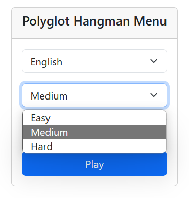

# Polyglot Hangman

## Purpose of the project

This app was created as a university project.

Polyglot Hangman is a word game in which the player guesses words in different languages at various levels of difficulty. The player can choose the language and level of difficulty they want to play in and then guess the word within a limited number of attempts. After guessing the word, the player can compare their time with other players on the leaderboard.

# Game

## Menu

Here is the game menu:

You can select game parameters:

- Language:

- Level of difficulty:

- And enter your nickname:

Next, you can press Enter or click the Play button.

## Gameplay

After starting the game, you will see a timer, the number of attempts left, wrong letters (which you have entered), selected parameters (language and level of difficulty), and the covered word, which you have to guess.

At the bottom, there is an input field for letters and a check button (you can also use Enter on your keyboard).

Here are the next phases of the game. You can notice that the number of attempts left is less than before and the wrong letters is shown, but the correct letters are uncovered in the word..

If you enter an incorrect letter, the attempt counter decreases and turns yellow, then red (but not in this example).

If you guess the word, you will receive congratulations, and you will see the leaderboard.

But… if you are not able to guess the word, you will see sad cats. But finally, you will see the covered word.

After finishing the game, you can click on the “Play again” button to play again and guess the next word!

# Technologies

I used Node.js with Express for the backend with a database in a JSON file.

For the frontend, I used Vue.js.
